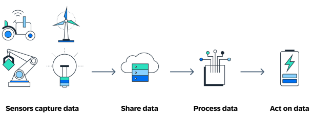

# MatLED

> **High School Graduation Project 2026**  
> **Specialization:** Mathematics & Computer Science  
> **Student:** Tundrea Cristina-Ioana  
> **High School:** Saint Sava National College, Bucharest, Romania  

---

## 📌 Introduction
### Choosing the project
The project's objective is controlling a LED matrix through an Android mobile app. I chose this project because I wanted to explore embedded systems, short wave wireless communication and mobile apps. 

Moreover, I wanted to practise theoretical knowledge gained throughout high school, regarding both informatics and physics, by building an interactive system. The project turned out to be interesting, as it required real-time optimization and limited space memory, as opposed to usual desktop apps.

### Project overview

The project's main purpose is controlling a display object capable of displaying alphanumerical characters, short animations, on a 256 light emitting diodes. The LED matrix is being controlled in real-time through a standardized Bluetooth channel, design in MIT App Inventor, for Android.

Using the MIT App Inventor software application and the Bluetooth module, I can send 2 default text messages that will glide from right to left, 2 short animations and one short text message that can be typed in the mobile app. The LED matrix will display the text message or animation in an endless loop, until given another instruction by the user, demonstrating the usage of if statements and while loops.

  
   
  <i>Figure 1: Overview of used components</i>

---

## 🛠️ Hardware Components & Technologies
### Hardware:
* Development Board: Arduino Uno R3 using the 8 bit ATmega328P microcontroller
* HC-05 Bluetooth Module
* LED Matrix (32 x 8) display using the MAX7219 driver
* Duracell 9 V alkaline battery
* Toshiba Heavy Duty 9 V battery
* Mini Breadboard
* Jumper Wires male to male
* Jumper Wires male to female
* Battery Cable
* USB Cable from AM to BM

### Software:
* **Arduino IDE 2.3.10** (C/C++)
* **Libraries:** `<MD_Parola.h>`, `<MD_MAX72xx.h>`, `<SPI.h>`, `<SoftwareSerial.h>`
  
---

  
   
  <i>Figure 2: Complete hardware setup with Arduino Uno, LED Matrix and HC-05 Bluetooth Module</i>

---

## 📄 Technical Documentation
### Table of contents:
1. Introduction & Justification
2. Hardware Components Overview
3. Circuit Schematic & System Architecture
4. Source Code Structure
5. User Guide & Mobile App Interface
6. Challenging issues
7. Internet of Things
8. Conclusion
9. Bibliography

---

## 🔌 Circuit Pinout
Brief overview of hardware connections:

|       **Component**      | **Module Pin** | **Arduino Pin** |             **Importance**            |
|:------------------------:|:--------------:|:---------------:|:-------------------------------------:|
|   _LED Matrix MAX7219_   |       VCC      |       5 V       |         Positive Alimentation         |
|                          |       GND      |       GND       |                 Ground                |
|                          |       DIN      |      Pin 11     |           Data Transmission           |
|                          |       CS       |      Pin 10     |              Chip Select              |
|                          |       CLK      |      Pin 6      |     Hardware Synchronization Clock     |
| _Bluetooth HC-05 Module_ |       VCC      |       5 V       |         Positive Alimentation         |
|                          |       GND      |       GND       |                 Ground                |
|                          |       TXD      |      Pin 2      | Serial Data Transmission (to Arduino) |
|                          |       RXD      |      Pin 3      |         Serial Data Reception         |

---

  
   
  <i>Figure 3: Initial Electrical Scheme</i>

---

  
   
  <i>Figure 4: Final Electrical Scheme</i>

---

## 🚀 Mobile App
### User Interface
In order to control the LED matrix display I created a mobile app in MIT App Inventor, compatible with Android.

Initially, the user interface was strictly functional, made to test out display commands and improve wireless data transmission issues.

  
   
  <i>Figure 5: First User interface in the Android Mobile App</i>

---
After solving data transmission issues, I upgraded the user interface. I created a ListPicker named Conecteaza Bluetooth that opens a list of nearby available Bluetooth devices. After picking the HC-05 Bluetooth Module, the Status Label Neconectat changes to CONECTAT. If any other problem occurs, the label switches to DECONECTAT.

Further down, there are two default messages that are displayed as gliding text from right to left and two quick, simple animations.

The third block is ment for a short text message typed in by the user.

  
   
  <i>Figure 6: User interface in the Android Mobile App</i>

### Instruction Blocks
When creating a mobile app in MIT App Inventor, you need to connect certain logical instruction blocks, transforming complex programming concepts like classes or entities into a more visual programming process.

  
   
  <i>Figure 7: Instruction Blocks 1</i>

Before clicking Conecteaza Bluetooth, the app interrogates the internal hardware component of the mobile phone **BluetoothClient1.AddressesAndNames**. After clicking the selection element, the app displays a list of nearby Bluetooth devices. After picking the HC-05 Bluetooth Module, the Status Label changes to CONECTAT.

Each button from the interface has an **when Button.Click do** event handler attached. After clicking, the app call the **BluetoothClient1.SendText** function to send a short message (1-5) via Bluetooth to the Arduino Uno.

For example, when clicking the **Hello World!** button, the app sends the character '1' through Bluetooth to the Arduino. The development board then processes this character in a switch statement.

As for the short text message typed in by the user, it gets send wirelessly with an extra character '5' at the beginning so the switch statement can figure out it is the text message. Then, the first character gets cut off, and the text displayed is the original one.

  
   
  <i>Figure 8: Instruction Blocks 2</i>

---

## 🧩 Challenging issues
The first issue was the insufficient tension provided by the 9V Toshiba Heavy Duty Battery or my Toshiba laptop. I realized that whenever I tried alimenting the circuit with these two, the Bluetooth Module didn't turn on because of lack of tension and the LED matrix had a sluggish performance.

At first, I thought this was caused by issues with the jumper wires, but the physical circuit was not the problem. In the mobile app, the Bluetooth Module wasn't even included in the list of available devices.

The Toshiba Heavy Duty Battery is a zinc-carbon battery and has a great internal resistance, fit for TV remotes or analog clocks. When connected to my circuit, it couldn't provide the necessary tension and so the voltage dropped below the operational threshold. As for my Toshiba laptop, it limited the voltage coming out because of a power saving setting and could frequently lead to excessive voltage drops caused by the length or width of the cable.

To solve this problem, I switched the Toshiba Battery with a 9V Duracell alkaline battery that has an insignificant internal resistance, ideal for the Bluetooth Module requiring 4.2 V - 5 V. 

The difference was immediate. The two lights on the Bluetooth Module were on, signaling it was ready to pair.

Another challenging situation was the Broken Pipe Error 516 coming in from the mobile app. The standard serial Arduino port timeout is 1000 ms. This means the code running on the Arduino pauses for a full second, waiting for a clear wireless message. 

With the help of the **BTSerial.setTimeout(50)**, I set the timeout to only 50 ms, allowing the development board to continue running the code in the loop after only 50 ms, preventing the system from crashing or the Bluetooth Module from disengaging.  

---

## 🌐 Internet of Things (IoT)

My small embedded system can be integrated in the concept of Internet of Things.

Usually, IoT defines any object or system containing objects that can connect wirelessly to an Internet network. Today, IoT means objects equipped with sensors, software technologies designed to receive and transmit data to inform the user or to automate an action.

IoT's main purpose is encouraging data interpretation in order to improve the results. 

  
   
  <i>Figure 9: Internet Of Things fundamental steps</i>

---

## 🧱 Final Overview

  
   
  <i>Figure 10: Final Project Overview</i>

